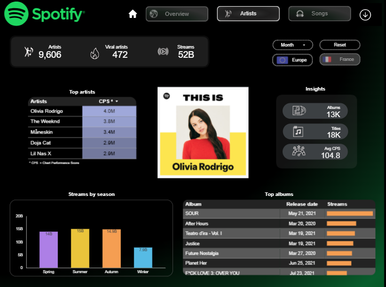

🎧 Spotify Editorial Strategy – Europe & France Focus

📌 Project Overview

The goal of this project was to provide data-driven insights to the Spotify Editorial Team to assist in playlist curation for the upcoming year. 
By analyzing the Top 200 and Viral 50 global playlists, we identified key success drivers with a specific focus on the European and French markets.

🛠 Tech Stack
* **Data Sources:** Kaggle datasets & Spotify API.
* **Data Warehouse:** Google BigQuery.
* **Transformation:** dbt (Data Build Tool).
* **Data Processing:** Python (used specifically for complex music genre mapping).
* **Visualization:** Looker Studio.

🏗 Data Pipeline & Methodology

1. Dual-Level Analysis: Artist & Track Performance
To provide a 360° view for the editorial team, we focused our analysis on two levels:
* **Flagship Artists:** Identifying consistent hit-makers and market leaders in Europe to secure the backbone of playlists.
* **Flagship Tracks:** Detecting "breakout" songs and viral hits, regardless of the artist's previous fame, to ensure playlists stay fresh and trend-driven.

2. Data Cleaning & Python Integration
Raw data often contains "noisy" genre information (artists linked to too many niche sub-genres).
We used Python to process and normalize the "Genre" table, ensuring the categories were clean and actionable for the editorial team.

4. Modeling with dbt
We followed best practices to transform raw data into business-ready tables:
* **Renaming & Cleaning:** Standardized column names and data types for consistency.
* **Geographic Filtering:** Focused the scope specifically on France and European territories.
* **Feature Engineering:** Combined ranking data with audio features (e.g., tempo, energy).

4. Key Performance Indicators (KPIs)
We developed several KPIs to measure track performance, such as:
* **Virality Coefficient:** Comparing a song’s growth in the Viral 50 vs. its stability in the Top 200.
* **Regional Genre Penetration:** Identifying which genres are trending specifically in France compared to the rest of Europe.
* **Artist Longevity:** Measuring how long tracks stay in the charts.

📊 Visualization

The final Looker Studio dashboard provides the Editorial Team with a clear view of which tracks and genres should be prioritized for next year's flagship playlists.

